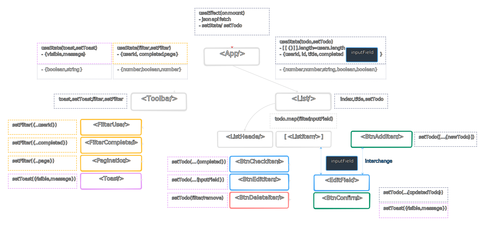
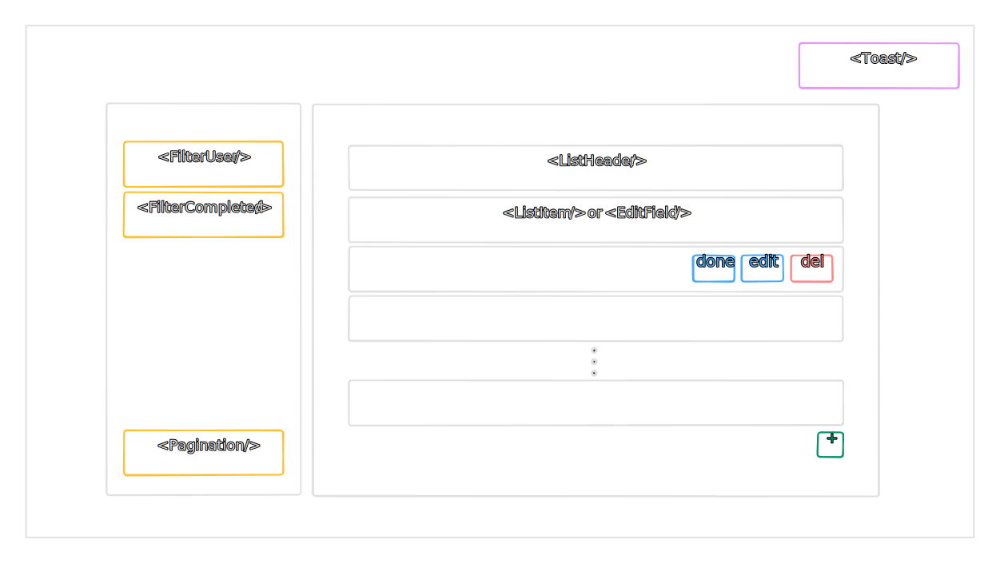
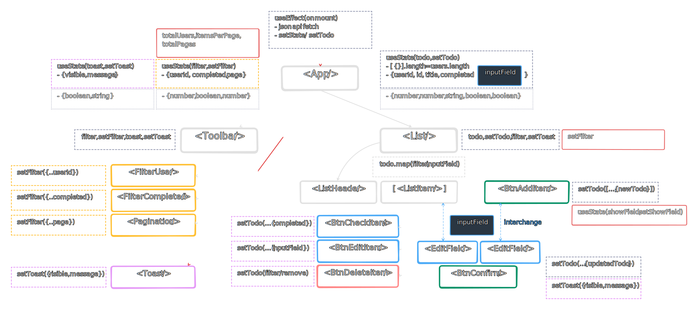

# Todo App (SPA)

This repo is for the frontend of a web app with initial dummy data pulled from [here](https://jsonplaceholder.typicode.com/todos). Apart from the fundamental CRUD features, the app will display a toast for the user actions, filter todo list based on userId, task completion and page number. The app will be integrated with unit testing using Jest in the future.

## Dependencies

- [React](https://reactjs.org/)
- [TypeScript](https://www.typescriptlang.org/)
- [Vite](https://vitejs.dev/)
- [Tailwind CSS](https://tailwindcss.com/)
- [DaisyUI](https://daisyui.com/)
- [React Icons](https://react-icons.github.io/react-icons/)
- [Jest](https://jestjs.io/), which is currently not properly set up. Please do not run tests yet.

## Installation

1. Clone the repository:

```bash
git clone https://github.com/mervin-njy/todo-app-react-ts.git
```

2. Navigate to the project directory:

```bash
cd todo-app
```

3. Install dependencies:

```bash
npm install
# or for reference ---------------------------------------------------
npx create-vite todo-app --template react-ts        # 1. React with TypeScript using Vite
cd todo-app                                         # 2. change to project directory for other installations
npm install                                         # 3. install Node.js dependencies
npm i -D tailwindcss@latest postcss autoprefixer    # 4. Tailwind CSS with PostCSS and Autoprefixer (for Vite)
npx tailwindcss init -p                             # 5. Create tailwind.config.js file
npm i -D prettier prettier-plugin-tailwindcss       # 6. Automatic class sorting with Prettier formatter
npm i -D daisyui@latest                             # 7. DaisyUI (UI utilities for Tailwind CSS)
npm i react-icons                                   # 8. React Icons

# for testing React components with TypeScript - To be continued.
npm i -D @types/jest jest @testing-library/react @testing-library/jest-dom
npm i --save-dev ts-jest jest-fetch-mock
```

### Notes

1. For usage of Tailwind CSS with Vite, please refer to the [documentation](https://tailwindcss.com/docs/guides/vite) if any issues arise during the installation.
2. For usage of prettier formatting of Tailwind CSS, ensure that you add a [Prettier config](https://github.com/tailwindlabs/prettier-plugin-tailwindcss) file in the main directory, like .prettierrc.

## Usage

1. Start the development server:

```bash
npm run dev
```

2. Open your browser and visit [http://localhost:3000](http://localhost:3000), or whichever port is available to you, for viewing of the application.

## App Layout and Components




## Project Structure

- `src/` - Contains the source code of the application.
  - `components/` - React components.
  - `pages/` - Application routes/pages.
  - `styles/` - Global styles and Tailwind CSS configuration.
- `tests/` - Contains test files for Jest.

## Post Assignment thoughts / further improvements or intentions

1. Perhaps showing the total number of tasks for each user within the toolbar makes it easier to track the changes made.
2. Adding a delay to automatically close Toast would be helpful.
3. Initially, the project structure has been thought of thoroughly, along with the flow of state and props. However, as the development continued, there were many changes that I couldn't foresee. I need to think of a more efficient way to plan and update changes to the component diagram.
4. To add on, I have yet to integrate the button components I initially planned because of the aforementioned changes. I will make the changes accordingly given more time.
5. Unit test has not been integrated yet, I think it will help a lot in scalability as well.

Here is what the final layout and component diagrams look like:


